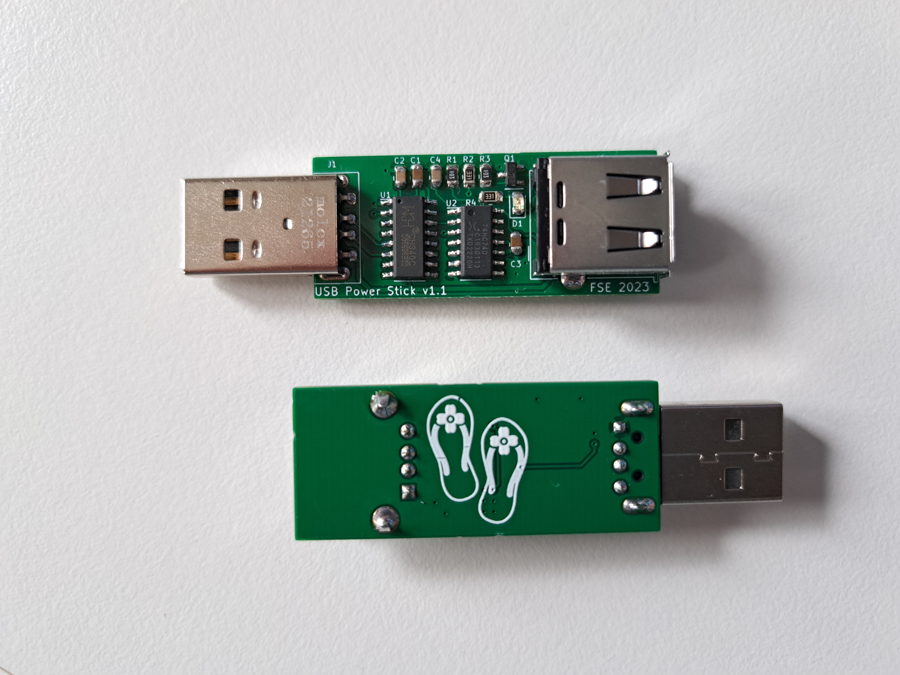
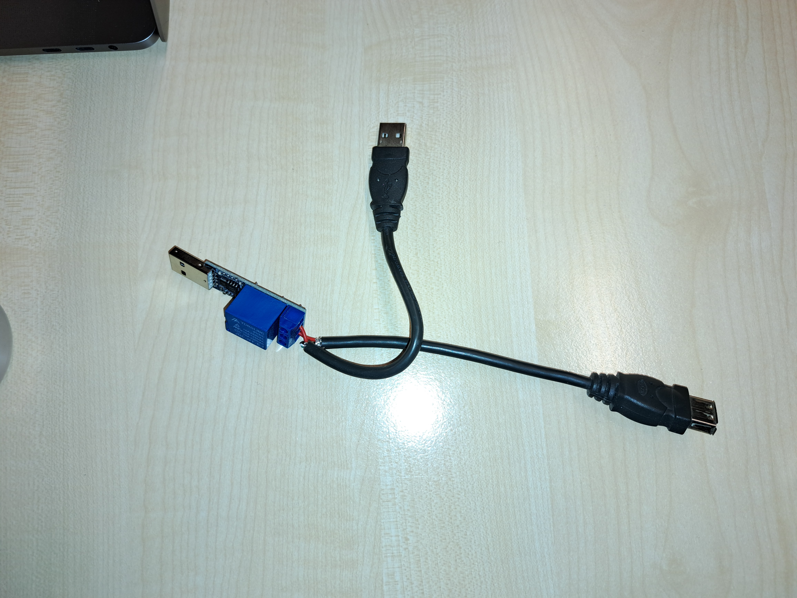

# USB Power Stick
The USB Power Stick is a USB Stick to control power (up to 1 A) to a USB powered device from a PC or SBC.

## Motivation
The Stick is inspired by the common [USB relay sticks](https://aliexpress.com/item/4001216792789.html). 
But using that stick to switch USB power on and off is messy: it requires cutting a USB extention cord, connecting the relay in between and takes up two USB ports. Leading to contraptions like this:

The USB Power Stick solves that problem neatly by providing the switched power on a USB Type A socket. 

The Stick is used to turn an [IKEA HÅRTE](https://www.ikea.com/nl/nl/p/harte-led-bureaulamp-zwart-zilverkleur-20527242/) light on and off using a Python script running on a Raspberry Pi. The light is used to illuminate a 3D printer, controlled by Octoprint, so a webcam can track the printer's progression during the night.

## How does it work
Take a look at the [PDF of the schematic](https://github.com/florisvde/usb-power-stick/blob/main/KiCad/usb-power-stick/usb-power-stick-schematic.pdf). 
The Stick makes use of a USB to serial converter, a flip flop and an output transistor to switch power on and off to the device connected to the Stick's output. The Stick does not provide USB connectivity to the Stick's output.

The RTS line of the serial converter can be controlled from a computer while the port is open. Therefore the RTS line is connected to the flip flop's (FF) data input (D) and the TX line to the FF's clock input (C). By sending a character the FF latches the current RTS state to the FF's output (Q), then the port can be closed again. This allows for a script to periodically turn power to the device on or off when needed.

An RC network is connected to the FF's asynchronous ~R input, to make sure the stick starts up in the off state, a so called Power on Reset (PoR) circuit.

## Build your own
You can send the Gerber files (directly downloadable as zip from the [releases page](https://github.com/florisvde/usb-power-stick/releases)) to any PCB manufacturer and have the boards made. The board is designed with manual assembly in mind, all parts are easily soldered using a standard soldering iron, fine solder and a pair of tweezers. For everything but the passives a shop link is provided in the [Bill of Materials (BOM)](https://github.com/florisvde/usb-power-stick/blob/main/KiCad/usb-power-stick/usb-power-stick-bom.md).
Pay attention to the pin 1 marker (triangle) of D1: the silk screened triangle is correct, the silk screened outline of the part is not!

## Use it
1. Install [Python](https://www.python.org/downloads/) for your OS.
1. Install the [PySerial package](https://pypi.org/project/pyserial/).
1. Plug the Stick into an computer.
1. Find the Stick's *device dev path* (Unix) by running `ls /dev/ttyUSB*` or *COM port* (Windows) by going to Device Manager.
1. Clone or download this repository.
1. Edit the `stick_on.py` and `stick_off.py` files to use the correct device dev path or COM port.
1. In the directory containing the scripts, run `python stick_on.py` to turn power to the load on, and run `python stick_off.py` to turn power to the load off.
